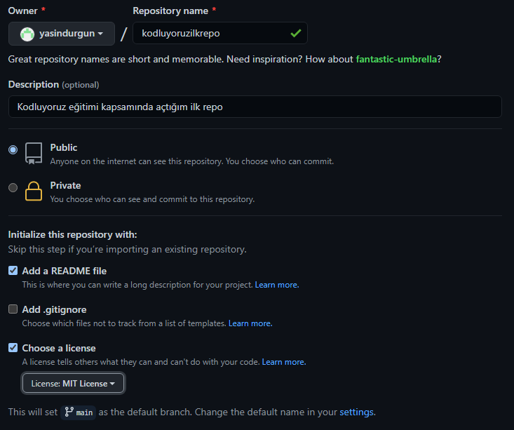

# Kodluyoruz İlk Repo



Bu repo [Kodluyoruz](https://www.kodluyoruz.org/) Front-End eğitiminde oluşturduğumuz ilk repo. İçerisinde bir adet README.md dosyası, bir adet de index.html barındırıyor.
## Installation
Öncelikle projeyi clonelayın. (Buraya sizin reponuzdan aldığınız link gelecek)

```
git clone https://github.com/yasindurgun/kodluyoruzilkrepo
```

## Usage
Projeyi cloneladıktan sonra Visual Studio Code Programında açınız.

Linux için:

```
cd kodluyoruzilkrepo
code .
```

## Contributing
Pull requestler kabul edilir. Büyük değişiklikler için önce neyi değiştirmek istediğinizi tartışmak için bir konu açınız.

## License
[MIT](https://opensource.org/licenses/MIT)
